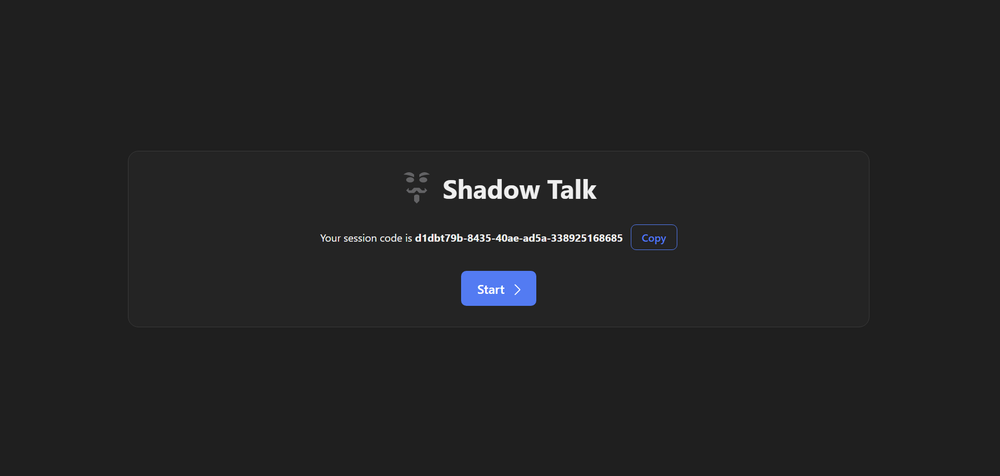
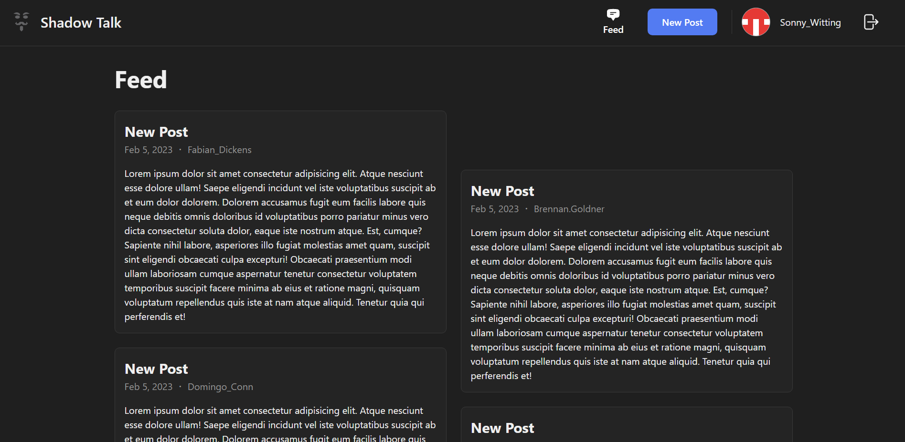

<p align="center">
  
  <h1 align="center">Shadow Talk</h1>
  <p align="center">
    A simple, secure, and anonymous social media.
  </p>
</p>

## Preview





## Description

Shadow Talk is a simple, secure, and anonymous social media. The application was built using React and TypeScript.

## Installation

Run the following commands to install the project dependencies.
```bash
npm install
```

## Development

To start the project in development mode, run the following command:
```bash
npm run dev
```

## Build

To build the project, run the following command:
```bash
npm run build
```
